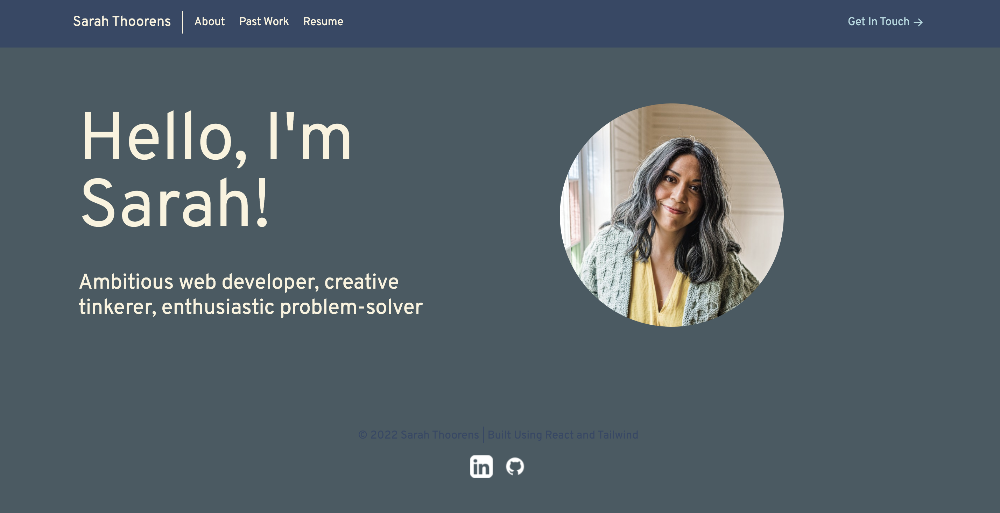

# React Portfolio


[](https://opensource.org/licenses/MIT)

 **Visit the [Deployed Site here.](https://sarahthoorens.github.io/react-portfolio/)**

  **Deployment Date:**  12/05/22 <br>
 
  **Technologies used:** Node.js,JavaScript,Tailwind CSS<br>

  **Project goal:** Create a professional portfolio using React <br>


  ## Table of Contents
  1. [Project Description](#Description)
  2. [Usage](#Usage)
  3. [Challenges Encounted](#Challenges)
  4. [Tests](#Tests)
  5. [License](#License)
  <br>
  
  ## Description
   This project was created to showcase my skills as a developer. It is a professional portfolio that includes my contact information, a brief bio, a portfolio snippets and links to my GitHub and LinkedIn profiles. It also includes a contact section where users can submit messages. 
   
   The program utilizes conditional rendering within React to populate linked pages. <br>

## User Story

```
AS AN employer looking for candidates with experience building single-page applications
I WANT to view a potential employee's deployed React portfolio of work samples
SO THAT I can assess whether they're a good candidate for an open position
```

## Acceptance Criteria

```
GIVEN a single-page application portfolio for a web developer
WHEN I load the portfolio
THEN I am presented with a page containing a header, a section for content, and a footer
WHEN I view the header
THEN I am presented with the developer's name and navigation with titles corresponding to different sections of the portfolio
WHEN I view the navigation titles
THEN I am presented with the titles About Me, Portfolio, Contact, and Resume, and the title corresponding to the current section is highlighted
WHEN I click on a navigation title
THEN I am presented with the corresponding section below the navigation without the page reloading and that title is highlighted
WHEN I load the portfolio the first time
THEN the About Me title and section are selected by default
WHEN I am presented with the About Me section
THEN I see a recent photo or avatar of the developer and a short bio about them
WHEN I am presented with the Portfolio section
THEN I see titled images of six of the developer’s applications with links to both the deployed applications and the corresponding GitHub repositories
WHEN I am presented with the Contact section
THEN I see a contact form with fields for a name, an email address, and a message
WHEN I move my cursor out of one of the form fields without entering text
THEN I receive a notification that this field is required
WHEN I enter text into the email address field
THEN I receive a notification if I have entered an invalid email address
WHEN I am presented with the Resume section
THEN I see a link to a downloadable resume and a list of the developer’s proficiencies
WHEN I view the footer
THEN I am presented with text or icon links to the developer’s GitHub and LinkedIn profiles, and their profile on a third platform (Stack Overflow, Twitter)
```

## Usage 

To use this program, simply visit the [deployed site](https://sarahthoorens.github.io/react-portfolio/). <br>

To deploy the application locally run ```npm start``` in the terminal.

## Deployed Screenshots

_<p align="center">Landing Page</p>_
</br>

  ## Challenges
This was my first React app build and my first time using Tailwind CSS. I originally built the site as a one-pager using href page anchors to move users to different sections of the page. Converting to conditional rendering was challenging, although less of a headache than I anticipated. The biggest issue I ran into was getting a "TypeError: "handleInputFom" is not a function" within my Contact.js. I eventually found my problem to be missing {} surrounding the function parameters. I appreciate the very specific nature of React and was glad to have found that particularly obvious solution. 

Deploying to GitHub Pages required some troubleshooting, as Tailwind uses a dead browerslist version.<br>

  ## Tests

  No tests were written for this program.

  ## License

  Click the badge to learn more about the license used for this project.
  <br>[](https://opensource.org/licenses/MIT)

  ## Questions?

  Find me on GitHub at: https://github.com/sarahthoorens

  You can also send any questions about this project to: s.thoorens@gmail.com

## Credits
<a target="_blank" href="https://icons8.com/icon/62856/github">GitHub</a> Icons by <a target="_blank" href="https://icons8.com">Icons8</a>

<a target="_blank" href="https://coolors.co/">Coolors</a> Color Scheme Generator